# DIAGRAMS — Flowboard

Aktor: **Owner**, **Staff**, **Admin platform**. Sistem, Pelanggan, Chatbot/MCP, Payment provider = peserta alur.

Acuan: [PLAN.md](./PLAN.md) · [FEATURES.md](./FEATURES.md)

---

## 1. Use case

```mermaid
flowchart TB
    Owner((Owner))
    Staff((Staff))
    Admin((Admin))

    subgraph FB["Flowboard"]
        direction TB

        subgraph setup["Setup"]
            UC1["Buat workflow manual"]
            UC2["Buat workflow wizard AI"]
            UC3["Edit stage + checklist"]
            UC4["Pasang action di baris checklist"]
            UC5["Atur rule stage\nreminder / on_reply / estafet"]
        end

        subgraph ingest["Masukkan pelanggan"]
            UC6["Tambah card manual"]
            UC7["Import CSV"]
            UC8["create_card MCP/API"]
            UC9["Estafet ke workflow lain"]
        end

        subgraph ops["Operasi"]
            UC10["Lihat Kanban"]
            UC11["Kerjakan checklist"]
            UC12["Geser card"]
            UC13["Assign / reassign"]
            UC14["Terima handover WA"]
        end

        subgraph monitor["Monitoring"]
            UC15["Dashboard stat"]
            UC16["Reminder overdue in-app"]
        end

        subgraph billing["SaaS"]
            UC17["Pilih paket + bayar"]
            UC18["Redeem voucher"]
            UC19["Kelola langganan"]
            UC20["Kelola voucher"]
            UC21["Lihat workspace / user / bayar"]
            UC22["Comp / extend trial"]
        end
    end

    Owner --> UC1
    Owner --> UC2
    Owner --> UC3
    Owner --> UC4
    Owner --> UC5
    Owner --> UC13
    Owner --> UC15
    Owner --> UC10
    Owner --> UC9
    Owner --> UC17
    Owner --> UC18
    Owner --> UC19

    Staff --> UC6
    Staff --> UC7
    Staff --> UC10
    Staff --> UC11
    Staff --> UC12
    Staff --> UC14
    Staff --> UC16

    Admin --> UC20
    Admin --> UC21
    Admin --> UC22

    UC12 -.->|"include"| UC11
    UC4 -.->|"extend"| UC3
    UC9 -.->|"include"| UC6
```

Chatbot tidak punya use case di dalam board: dia pemakai **UC8**.

### Matriks wewenang

| Use case | Owner | Staff | Admin platform |
|---|---|---|---|
| Workflow, stage, checklist, action, rule | ya | tidak | tidak |
| Wizard AI | ya | tidak | tidak |
| Assign / reassign | ya | tidak | tidak |
| Tambah card, import CSV | ya | ya | tidak |
| Kanban + checklist + geser | pantau semua | card-nya | tidak |
| Handover WA + reminder in-app | pantau | target | tidak |
| Dashboard 4 stat | ya | ringkas milik sendiri | tidak |
| Estafet “Lanjut ke …” | ya | ya (card-nya) | tidak |
| Paket, bayar, redeem voucher, batal | ya (workspace) | tidak | lihat |
| Buat voucher, comp trial, semua workspace | tidak | tidak | ya |

---

## 2. Swimlane

### 2.1 Setup workflow

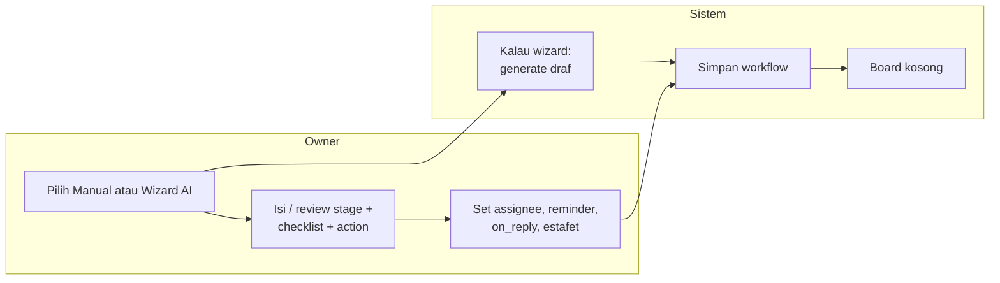

### 2.2 Pelanggan masuk → selesai (+ estafet)

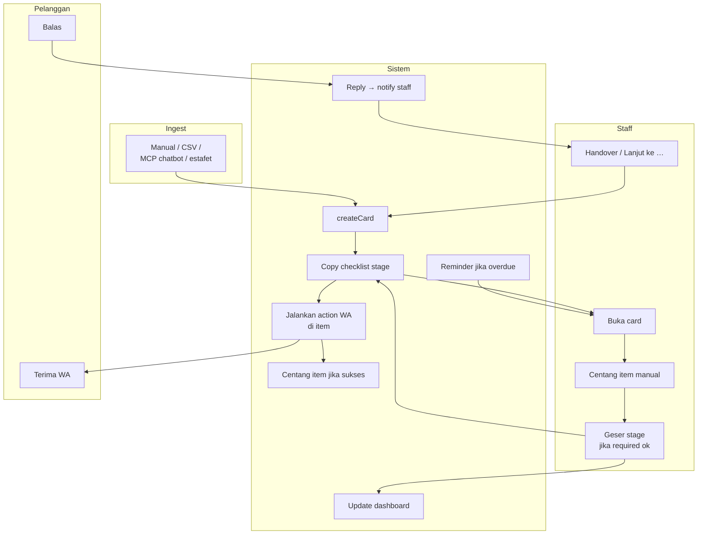

### 2.3 Reminder vs WA vs MCP

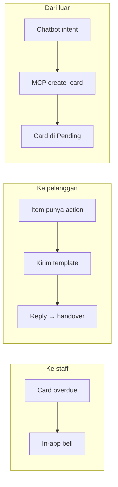

---

## 3. Sequence

### 3.1 Wizard AI lalu edit manual

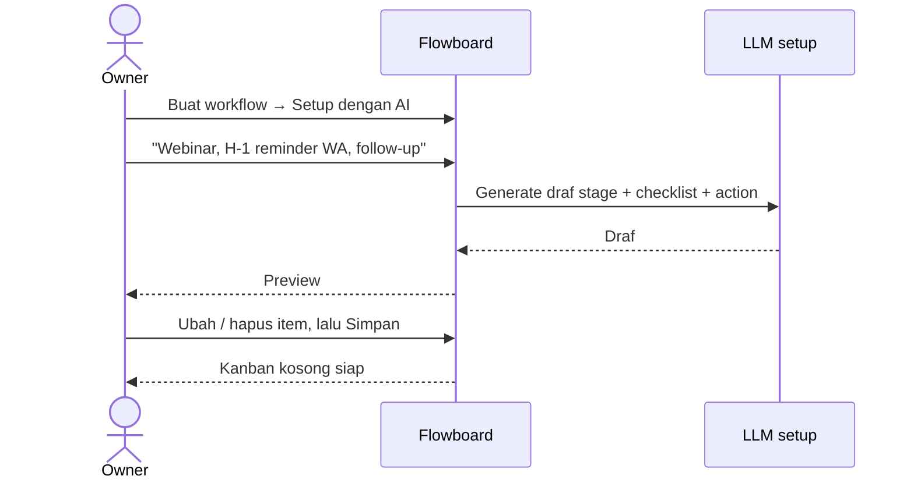

### 3.2 createCard (manual / CSV / MCP sama)

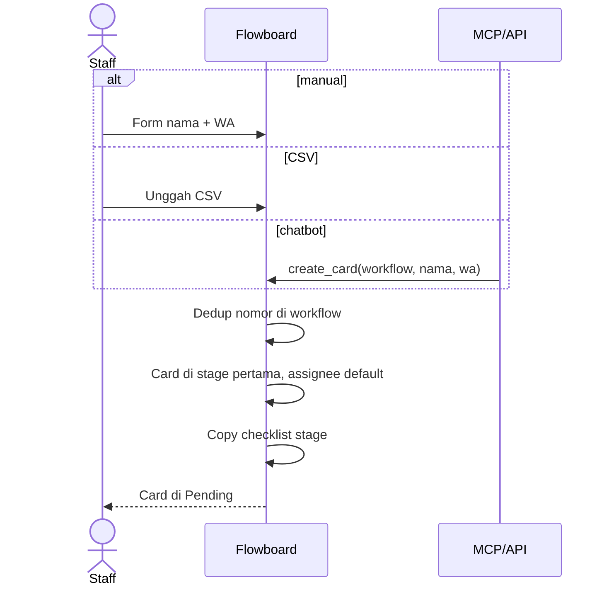

### 3.3 Geser stage + gate checklist

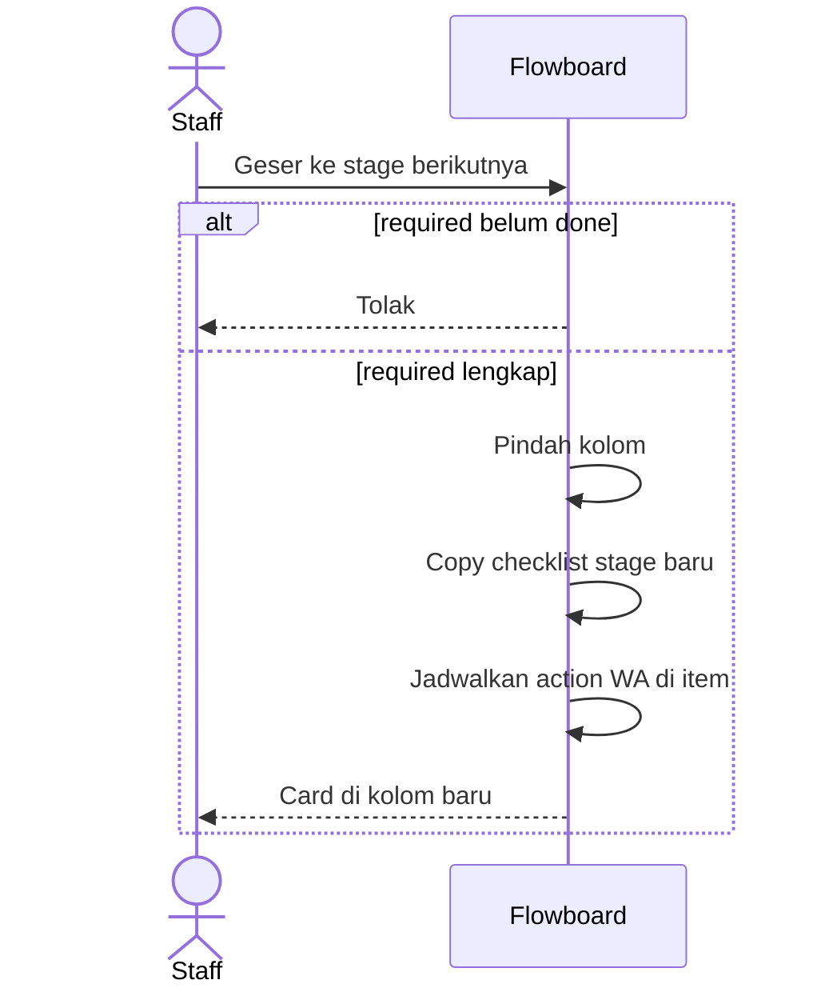

### 3.4 Action WA mencentang checklist + handover

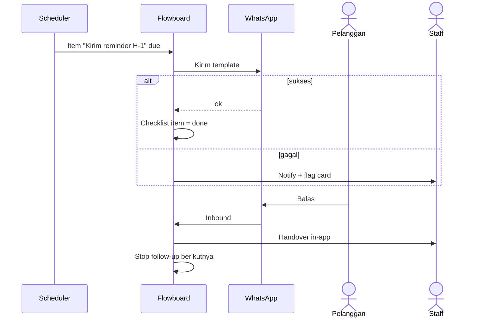

### 3.5 Estafet

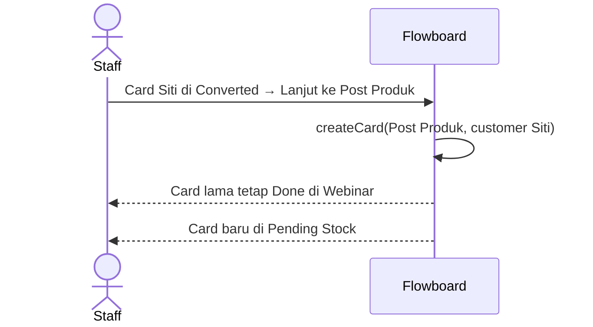

### 3.6 Dashboard

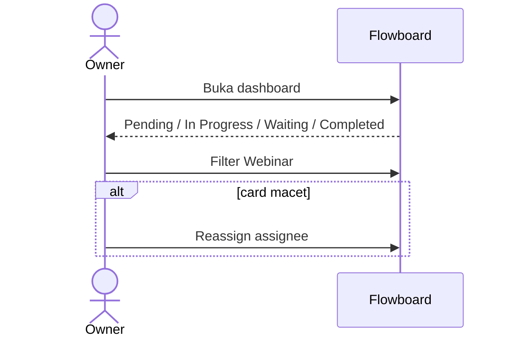

### 3.7 Langganan + voucher

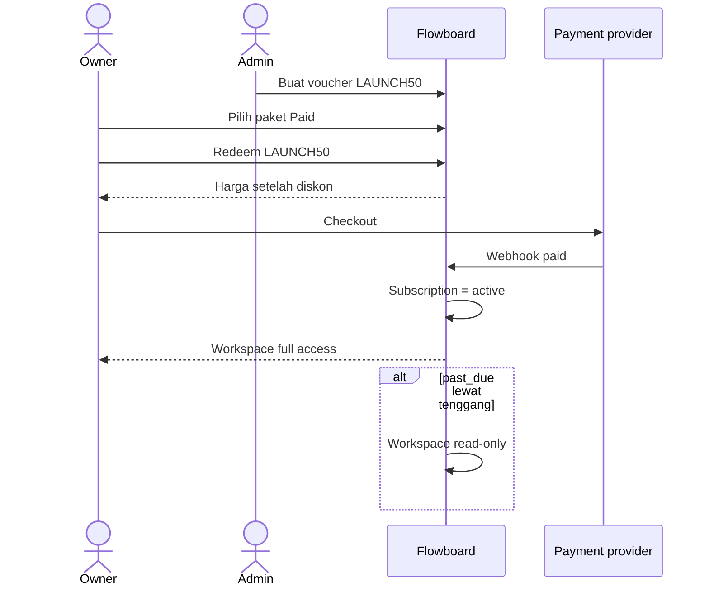

---

## 4. Class diagram

Action menempel di `ChecklistTemplate`. Rule sampingan di `StageRule`. `Customer` = identitas Kanban. Langganan = `Subscription` di workspace, bukan di pelanggan onboarding.

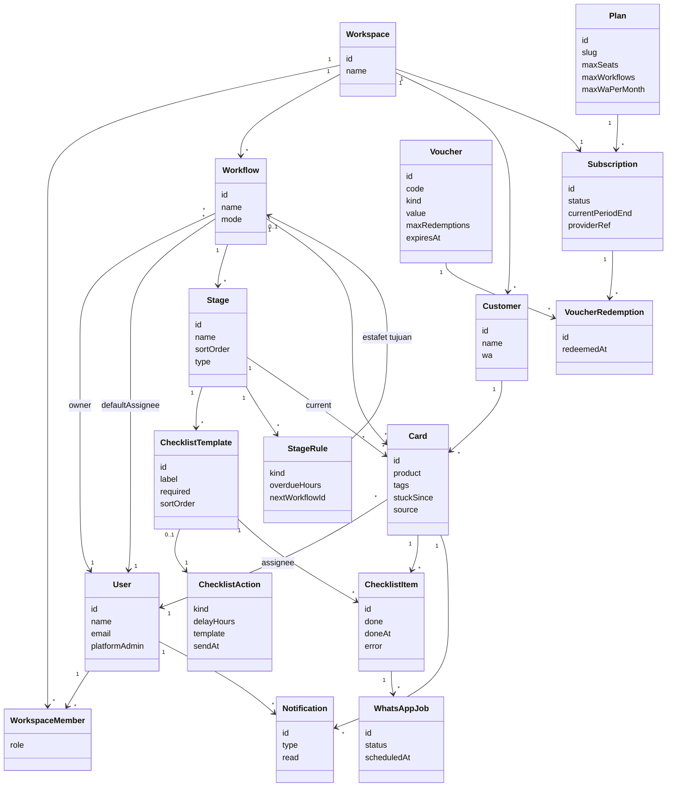

`ChecklistAction.kind`: `send` | `followup`  
`StageRule.kind`: `on_reply` | `reminder` | `estafet`  
`Card.source`: `manual` | `csv` | `mcp` | `estafet`  
`WhatsAppJob.status`: `scheduled` | `sent` | `failed`  
`Subscription.status`: `trial` | `active` | `past_due` | `canceled`  
`Voucher.kind`: `percent` | `fixed` | `trial_days`

---

## 5. Ringkasan aktor

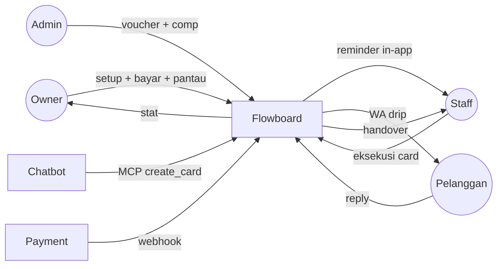
