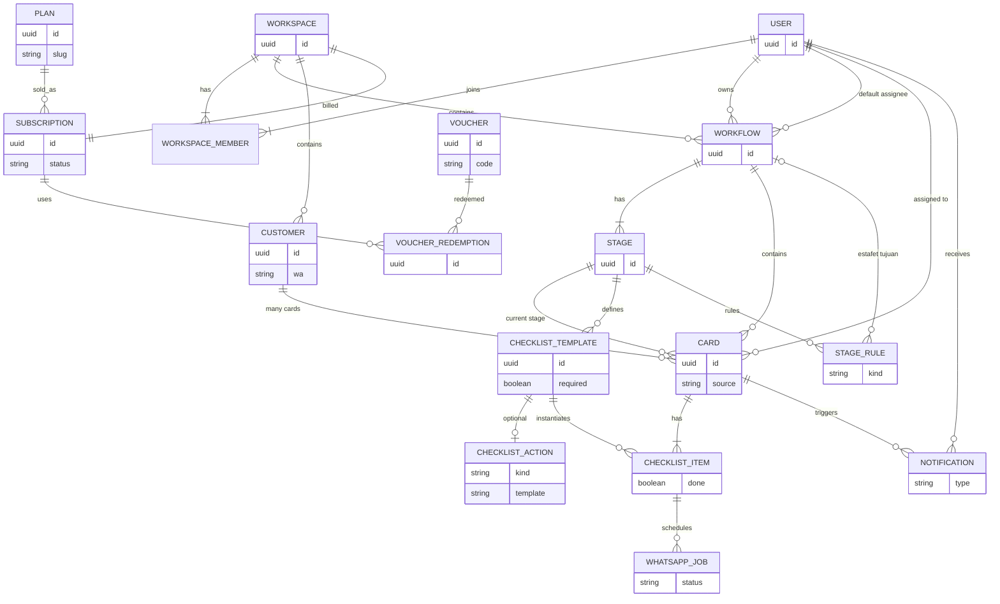

# PLAN — Flowboard v1

Sumber analisis: [APP.md](./APP.md) · landing page [flowwboard.vercel.app](https://flowwboard.vercel.app/)  
Fitur: [FEATURES.md](./FEATURES.md) · Diagram: [DIAGRAMS.md](./DIAGRAMS.md) · Kanban: [KANBAN.md](./KANBAN.md) · Setup: [SETUP.md](./SETUP.md) · Todo: [TODO.md](./TODO.md)

---

## 1. Definisi produk

**Model:** SaaS

**Nama jenis produk:** Customer Onboarding Management System — ops tracker untuk *journey* pelanggan, bukan project management umum dan bukan CRM penjualan.

**Filosofi:** sistem yang mengejar staff, bukan staff yang mengingat semuanya.

Satu pelanggan yang masuk proses (beli, daftar webinar, jadi VIP) menjadi **1 card**. Card itu dipaksa lewat **stage yang sama** sampai selesai. Leader melihat papan + angka. Sistem yang ngejar staff kalau card macet. WhatsApp dipakai untuk pesan ke **pelanggan**, bukan untuk reminder internal.

Bukan:
- CRM pipeline deal
- task board bebas (Jira / Trello sembarang kartu)
- workflow builder antar-app (Zapier)

Campuran: **CRM ringan + Kanban + checklist standar + reminder ke staff + WhatsApp ke customer**.

---

## 2. Pain

1. **Pelanggan tercicir** — tidak ada tracking standar. Sebagian dapat follow-up, sebagian terlepas. Siapa belum daftar / belum pos, tidak ada yang tahu.
2. **Staff lupa follow-up** — tiap staff cara sendiri (notebook, HP). Cut / resign → data hilang.
3. **Burnout & inconsistent** — leader mengejar staff satu per satu. “Diana, siapa yang belum pos?” berulang setiap hari.

---

## 3. Aktor

| Aktor | Siapa | Tanggung jawab |
|---|---|---|
| **Owner** | PIC / leader proses (contoh situs: Raduan, Hamizah) | Definisikan workflow, stage, checklist, aturan reminder & WA. Pantau dashboard. Assign / reassign staff. Bayar langganan workspace. |
| **Staff** | Assignee pelaksana (contoh situs: Diana) | Kerjakan card yang di-assign: checklist, geser stage, follow-up manual, terima handover WA. |
| **Admin platform** | Operator SaaS Flowboard | Kelola user, workspace, langganan, voucher. Bukan PIC Kanban. |
| **Sistem** | Flowboard | Enforce checklist, kirim reminder ke staff, kirim WA ke customer, hitung stat dashboard, tagih langganan. |
| **Pelanggan** | Orang yang di-onboard | Daftar / bayar, terima WA, balas pesan (bisa picu handover). Tidak login ke board. |

Owner dan Staff adalah **peran per workflow**, bukan dua jenis akun kaku. User A bisa owner di workflow Webinar dan staff/assignee di workflow Post Produk.

**Admin platform** ≠ Owner. Admin = operator SaaS Flowboard. Owner = yang bayar workspace dan atur Kanban. **Pelanggan** di board (Siti) ≠ subscriber yang bayar Stripe.

---

## 4. Mapping bahasa CEO → model produk

Sub-feature di v1 = **kolom Kanban (stage)**, bukan papan nested di dalam stage.

```text
Workflow (template proses)          ← “feature”
  └── Stage / kolom Kanban          ← “sub-feature”
        └── Card (1 pelanggan)      ← instance yang sedang jalan
              ├── Assignee
              ├── Tag (Urgent, VIP)
              └── Checklist item
```

| Bahasa CEO | Bahasa produk | Contoh |
|---|---|---|
| Feature | **Workflow** | Pendaftaran Peserta Webinar |
| Sub-feature | **Stage** | Pending Users → Confirmed → Reminder H-1 → Attended → Follow-up → Converted |
| — | **Card** | Siti Aminah yang daftar webinar 14 Agu |
| — | **Checklist** | cek bayar, kirim Zoom, add grup WA |

1 workflow = 1 jenis proses operasional. Stage linear, boleh ada cabang (Approved / Rejected).

---

## 5. Model data v1



Class diagram lengkap: [DIAGRAMS.md](./DIAGRAMS.md) §4.

### Aturan relasi

- **Assignee di card** — PIC pelanggan itu. Wajib v1.
- **Owner di workflow** — PIC proses.
- **Default assignee di workflow** — card baru otomatis ke staff itu, bisa diganti per card.
- **Checklist template di stage** — di-copy ke card saat card masuk stage itu. Spine kerjaan stage.
- **WA action di item checklist** — opsional. Item tanpa action = manual. Item dengan action = sistem yang ngerjain, sukses → item tercentang.
- **Rule di stage** (bukan checklist) — `on_reply` handover, reminder overdue, estafet. Ini bukan langkah kerjaan.
- **Langganan di workspace** — 1 subscription per workspace. Owner yang bayar. Staff ikut kuota.
- **Voucher** — kode promo, di-redeem ke subscription workspace. Admin platform yang buat.
- **Admin platform ≠ Owner** — operator produk vs PIC proses pelanggan.

---

## 6. Modul fitur v1

### 6.1 Workflow & stage — cara setup

Workspace punya banyak workflow. Setup **bukan AI-only** dan **bukan manual-only**. Dua pintu, hasilnya editor yang sama.

```text
Workspace
  └── Buat workflow
        ├── Manual          → editor kosong
        └── Wizard AI       → draf stage + checklist → Owner edit → simpan
        └── (nanti) template Webinar / Onboarding / Booking
```

**Manual** — Owner yang tahu prosesnya. Nama workflow, owner, default assignee, stage satu-satu, checklist (+ action) per stage, rule stage. Wajib ada: AI down / proses aneh / mau utak-atik setelah wizard.

**Wizard AI** — bootstrap, bukan ganti editor.

1. Owner tulis singkat: *“Pendaftaran webinar, dari daftar sampai follow-up, reminder H-1 via WA.”*
2. AI usul: stage, checklist, action WA, template draf.
3. Preview. Owner hapus/tambah/ubah.
4. Simpan → jadi workflow biasa, selanjutnya diedit manual.

AI tidak mengunci struktur. Tidak generate card pelanggan.

Urutan setup workspace:

```text
1. Workspace + invite staff (Diana, …)
2. Buat workflow (manual / wizard)
3. Isi stage + checklist + action
4. Masukkan pelanggan → card (modul 6.9)
```

### 6.2 Card pelanggan + Kanban

1 card = 1 pelanggan di 1 workflow. Field: nama, produk/sumber, stage, tag, assignee. Drag & drop antar stage.

Contoh webinar:

```text
Pending Users → Confirmed → H-1 Reminder → Attended → Follow-up → Converted
```

Bukan task board bebas. Kartu selalu orang yang sedang di-onboard.

### 6.3 Checklist (+ action di baris yang sama)

Langkah wajib **di dalam card**, bukan kolom Kanban. Sistem enforce template yang sama untuk semua pelanggan di stage itu. Card tidak boleh dianggap selesai di stage jika item `required` masih kosong.

**Setup digabung, bukan dua layar.** Owner bikin checklist; di baris itu boleh pasang action. Tidak ada tab “Actions” terpisah yang harus di-link manual.

```text
Checklist — stage H-1 Reminder
  ☐ Kirim reminder H-1     required   action: WA send     H-1 09:00
  ☐ Kirim link Zoom        required   action: WA send     H-1 09:00
  ☐ Konfirm hadir          optional   action: WA followup H-1 18:00 jika belum bales
  ☐ Catatan internal       optional   action: (kosong = staff)
```

Kenapa gabung:
- Satu sumber kebenaran — “kirim reminder” tidak ditulis dua kali (sekali di checklist, sekali di action).
- Progress `2/3 ✓` di kartu langsung = langkah stage itu, entah manusia atau bot.
- Sukses kirim WA = baris itu tercentang, tanpa mapping terpisah.

Kenapa tidak 100% jadi satu benda:
- **Handover / on_reply**, reminder ke staff, estafet = aturan stage, bukan baris “yang harus dicentang.” Itu tetap di setting stage.

Jadi: **kerjaan = checklist. Automasi = properti baris. Rule sampingan = level stage.**

### 6.4 Reminder — ke staff

Nudge internal: “Diana, card Siti Aminah stuck di Follow-up 2 hari.”

| Channel v1 | Target | Status |
|---|---|---|
| In-app (bell + highlight overdue) | Staff | wajib |
| Email digest | Staff | nice-to-have |
| WhatsApp ke staff | Staff | nanti |
| WhatsApp ke customer | Pelanggan | **bukan reminder** — modul 6.5 |

### 6.5 WhatsApp — ke pelanggan

Landing page: *“AI yang hantar mesej, bukan staff yang type.”*  
Itu **bukan** “ada ChatGPT yang ngobrol sama customer.” Yang didemo: sistem yang **kirim pesan terjadwal**, staff tidak ngetik satu-satu.

Dua lapisan, jangan dicampur:

| | Lapisan A — drip / action (inti situs) | Lapisan B — chat agent (implikasi “AI” + handover) |
|---|---|---|
| Siapa kirim | Flowboard, sesuai rule di stage | Agent percakapan di WhatsApp |
| Isi pesan | Template (tulis sendiri / generate AI **saat setup**) | Balasan dinamis per chat |
| “AI” yang dimaksud | Otomasi + boleh bantu nulis template | LLM yang baca intent & bales |
| Handover | Customer **balas** → notify assignee | Agent deteksi “butuh orang” → notify + pause auto |

v1 = **lapisan A**. Lapisan B opsional, disambung dari luar (bukan dibangun di dalam board).

#### Action menempel di item checklist (bukan daftar terpisah)

Satu stage banyak item; item yang perlu WA tinggal dikasih action. H-1 webinar:

```text
Stage: H-1 Reminder
  ☐ Kirim reminder H-1   required  → send "Reminder jam 19"     H-1 09:00
  ☐ Kirim link Zoom      required  → send "Link Zoom"           H-1 09:00
  ☐ Konfirm hadir        optional  → followup kalau belum bales H-1 18:00
  ☐ Catatan internal     optional  → (manual)

  rule stage: on_reply → notify assignee
```

#### Action boleh update checklist

Item **punya** action (bukan di-link dari daftar lain). Bot kirim sukses → baris itu `done`. Staff tidak centang “sudah kirim WA” manual.

| Event action | Efek ke item itu |
|---|---|
| WA terkirim sukses | `done` |
| WA gagal / nomor invalid | tetap kosong + flag di card, notify assignee |
| Customer balas / konfirm | item follow-up (mis. Konfirm hadir) → `done` |
| Handover | tidak auto-centang yang masih required manusia |

Yang tidak: action **tidak** geser stage sendiri di v1. Geser stage tetap staff, atau belakangan rule terpisah (“semua required dicentang → boleh auto-move”).

Item tanpa action = tetap manual.

Tiga jenis action (di baris checklist, kecuali handover):

1. **Send** — sekali, jam yang di-set (intro, link portal, link grup, reminder H-1).
2. **Follow-up** — terjadwal / “kalau belum bales” (H-1 sore, hari 3/7/14).
3. **Handover** — rule **stage**, bukan baris checklist. Henti auto, lempar ke staff.

Isi pesan: **template Owner**. Boleh “Generate dengan AI” waktu bikin template (bantu nulis), lalu yang dikirim tetap teks itu + variabel (`{{nama}}`, `{{link_zoom}}`). Yang “hantar” tetap sistem, bukan AI yang improvisasi di chat.

Contoh situs dipetakan ke stage:

| Touchpoint situs | Bukan “AI ngobrol”, tapi |
|---|---|
| Welcome + link portal | item checklist + action `send` di stage Register |
| Link grup VIP | item terpisah + action `send` (stage yang sama / berikutnya) |
| Follow-up hari 3 / 7 / 14 | 3 item + action `followup` (delay) |
| Human handover | rule stage: customer balas → staff |

#### Human handover — kapan masuk akal

Tanpa inbound chat, handover memang **tidak masuk akal**: tidak ada yang di-takeover.

Masuk akal di dua tingkat:

**v1 — handover ringan (cukup untuk drip)**  
Customer membalas WA. Sistem tidak “paham” advanced vs tidak. Rule kasar: ada reply → notifikasi assignee + (opsional) stop follow-up berikutnya. Staff buka chat, lanjut manual. Ini yang masuk akal tanpa chat agent.

**Nanti — handover berat (perlu agent)**  
Baru “bila pelanggan menunjukkan keperluan advanced.” Itu butuh yang **baca percakapan**: intent, FAQ vs komplain, minta orang. Bukan kerjaan Kanban.

#### Chat agent + MCP — bukan isi Flowboard, tapi tetangga

Hipotesis yang pas: Flowboard **tidak** jadi WhatsApp bot. Board = ops. Agent = percakapan. Disambung tool/MCP/webhook.

```text
Pelanggan WA
    │
    ▼
Chat agent          ← bales FAQ, drip, deteksi intent
    │
    │  tools
    ├─ create_card(workflow, customer)   ← “mau daftar webinar”
    ├─ move_stage(card, stage)           ← “udah bayar”
    ├─ notify_assignee(card)             ← handover
    └─ stop_followups(card)
    │
    ▼
Flowboard Kanban    ← source of truth stage / checklist / assignee
```

Maka:

- Insert user ke workflow sesuai intent → **agent yang panggil**, bukan board yang tebak.
- Handover pada kondisi tertentu → **agent yang putuskan**, board yang nge-notify staff + tandai card Waiting Action.
- Drip hari 3/7/14 tetap bisa hidup di board (action stage) **atau** di agent; jangan dobel kirim.

v1 tidak wajib punya agent. Board sudah berguna: action WA di stage + template + reply → ping staff. Agent disambung belakangan tanpa ganti model Kanban.

---

### 6.6 Dashboard stat

Bukan analytics berat. Jawaban untuk “siapa yang belum pos?”:

- Urgent / Pending
- In Progress
- Waiting Action
- Completed

Filter per workflow. Owner lihat big picture tanpa tanya satu-satu.

### 6.7 Satu pelanggan, banyak workflow (paralel)

Tetap ada. 1 card = 1 pelanggan × 1 workflow, tapi **1 pelanggan boleh punya banyak card sekaligus**.

```text
Siti Aminah
  ├── card di Webinar      → Follow-up      (belum selesai)
  └── card di Post Produk  → Pending Stock  (jalan bareng)
```

Tidak perlu nunggu yang satu Done. Dua board, dua checklist, assignee boleh beda. Yang nyambung cuma identitas pelanggan.

### 6.8 Estafet antar-workflow

Ini **tambahan**, bukan pengganti paralel. Selesai di A → card baru di B (customer yang sama).

```text
Webinar  [Converted]  ──spawn──►  Post Produk  [Pending Stock]
   card Siti tetap di Done              card Siti baru muncul
```

- Trigger: card masuk stage tertentu (biasanya stage terakhir / Converted).
- Aksi: buat card di workflow tujuan, stage awal, copy nama + produk, assignee = default workflow tujuan (bisa beda orang).
- Card lama **tidak pindah board** — tetap di Done workflow 1, jadi riwayat.
- v1 cukup **1 next workflow** per stage (bukan cabang banyak).
- Bisa auto (masuk stage → langsung spawn) atau tombol **Lanjut ke …** di panel card.

Dua mode ini hidup bareng: Siti bisa sudah di Post Produk lewat estafet, dan **sekaligus** masih di Booking Meeting Room secara paralel.

### 6.9 Masukkan pelanggan ke workflow

Staff workspace ≠ pelanggan. Invite Diana = anggota tim. Siti Aminah = **card**.

Semua jalur masuk nembak **satu** `createCard`. Chatbot tidak punya pintu ajaib sendiri — dia client MCP/API.

```text
createCard(workflow, customer, source)
  ├── Manual          form di board
  ├── Import CSV      daftar webinar / Excel
  ├── MCP / API       chatbot, form, payment webhook
  └── Estafet         spawn dari workflow lain
```

| Jalur | Kapan | v1 |
|---|---|---|
| **Tambah manual** | 1–2 orang, exception | wajib |
| **Import CSV** | 50–500 peserta webinar | wajib |
| **MCP / API** | chatbot, integrasi | kontrak v1, pemakaian menyusul |
| **Estafet** | selesai workflow A | ya (tombol dulu) |
| Form publik / bayar webhook | daftar sendiri | nanti (tetap `createCard`) |

Chatbot **masuk**. Intent “mau daftar webinar” → `create_card(workflow: Webinar, nama, wa)`. Card muncul di Pending. Integrasi chatbot = pemakai MCP, bukan modul Kanban baru.

Import: kolom minimal `nama`, `wa`/`telepon`. Opsional produk, tag. Assignee = default workflow, bisa di-map dari CSV. Duplikat (nomor sama di workflow yang sama): skip / update, jangan dobel card diam-diam.

### 6.10 Langganan, pembayaran, voucher, admin

SaaS. Yang ditagih = **workspace**. Jangan campur dengan “pelanggan” di Kanban (Siti Aminah) atau webhook bayar webinar.

```text
Admin platform          Owner workspace
  voucher, comp           pilih paket → voucher? → bayar
                                ↓
                         Workspace.subscription
                           trial | active | past_due | canceled
```

**Paket v1 (isi angka belakangan):** trial (waktu terbatas), paid. Kuota: anggota, workflow, kiriman WA / bulan. Melebihi kuota → block aksi itu, bukan hapus data.

**Pembayaran:** checkout provider (Stripe atau setara). Webhook provider → update status langganan. Owner lihat billing di setting workspace.

**Voucher:**

| Tipe | Efek |
|---|---|
| `percent` | diskon % di checkout |
| `fixed` | potongan nominal |
| `trial_days` | perpanjang / kasih trial |

Kode, kadaluarsa, max redeem global, 1x per workspace. Admin buat; Owner pakai di checkout atau halaman billing.

**Admin platform:** daftar user & workspace, lihat status bayar, buat/nonaktif voucher, extend trial / ganti paket manual. Tidak masuk Kanban sehari-hari.

Gate: `canceled` / `past_due` lewat tenggang → workspace read-only (lihat board, tidak createCard / tidak kirim WA).

---

## 7. Alur inti (ringkas)

```text
Owner atur workflow + stage + checklist + WA/reminder
        ↓
Card dibuat (manual / daftar) → assignee default
        ↓
Kanban: Pending → … → Follow-up → Done
        ↓
Masuk stage → checklist di-copy ke card
        ↓
Card macet → reminder ke staff (in-app)
        ↓
Stage ber-WA-auto → pesan ke customer
        ↓
Customer butuh orang → handover ke staff
        ↓
Dashboard: berapa stuck, berapa selesai
```

Detail use case / swimlane / sequence / class: [DIAGRAMS.md](./DIAGRAMS.md). Fitur: [FEATURES.md](./FEATURES.md). Pengerjaan: [TODO.md](./TODO.md).

---

## 8. Keputusan terbuka (kunci dengan CEO)

1. **Sub-feature = kolom Kanban, atau papan nested?** v1 usul: kolom saja. Nested membengkak.
2. **1 pelanggan di banyak workflow sekaligus (paralel)?** Ya — 1 orang, banyak card. Sudah dikunci.
3. **Estafet: auto-spawn vs tombol “Lanjut ke …”?** Keduanya valid. Usul v1: tombol dulu (staff yang picu), auto belakangan.
4. **Reminder v1 channel apa?** Usul: in-app dulu.
5. **WA v1: drip action di stage saja, atau langsung sambung chat agent?** Usul: drip dulu (send / follow-up / reply→notify). Agent + MCP belakangan.
6. **Template WA: tulis sendiri vs generate AI saat setup?** Boleh dua-duanya; yang dikirim tetap template, bukan improvisasi live.
7. **Card dibuat dari mana?** Semua jalur: manual + import CSV + MCP/API (chatbot pakai ini) + estafet. Sudah dikunci. Form publik belakangan.
8. **Paket & harga?** Angka kuota belum dikunci. Model: trial + paid, tagihan per workspace.
9. **Provider bayar?** Usul Stripe (atau setara). Jangan bangun payment gateway sendiri.

---

## 9. Scope v1 vs nanti

| Masuk v1 | Belum v1 |
|---|---|
| Workflow, stage, card, kanban | Nested sub-board |
| Owner + staff assignee | Role matrix rumit |
| Checklist per stage | Checklist cabang dinamis |
| Reminder in-app ke assignee | WA/email ke staff |
| WA drip: send / follow-up per stage + reply→notify | Chat agent di dalam Flowboard |
| Template WA (manual atau generate saat setup) | AI improvisasi balasan live |
| Dashboard 4 stat | Analytics cohort / funnel berat |
| 1 card = 1 customer × 1 workflow | Portal login pelanggan |
| 1 customer boleh banyak card (paralel) | — |
| Estafet: spawn card ke workflow berikutnya (1 tujuan) | Cabang banyak tujuan / drag antar-board |
| Workflow setup: manual + wizard AI | Template marketplace / AI yang kunci struktur |
| createCard: manual + CSV + MCP/API | Form publik, payment webhook pelanggan |
| Langganan workspace + checkout + voucher | Usage-based billing, refund penuh di self-serve |
| Admin platform: user, workspace, voucher, comp | Impersonate, finance export berat |
